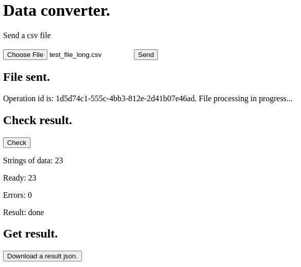

# Tetrika-test

## Описание задачи

[ссылка](https://gist.github.com/KonstantinKlepikov/9e4a882e7ec5456ee30393546505c55d)

## Схема приложения


## Ресурсы

### Разработка локально

Для запуска необходимо клонировать репозиторий и поместить в корень репозитория `.env` файл следующего содержания^

```bash
# redis url
REDIS_PORT=6379
REDIS_DB=0
REDIS_HOST=tetrika-redis

TEST_REDIS_PORT=6379
TEST_REDIS_DB=0
TEST_REDIS_HOST=test-tetrika-redis
```

Вам потребуется не менее`docker compose 3.8` и утилита `make` для запуска стека. Обратите внимание, что должен быть свободен порт на хост-машине, к которому обращается стек для отображения html-страниц (смотри docer-compose файл).

### Старт и остановка dev стека

1. Перейди в `cd api/app`
2. Установите `poetry` окружение и подготовьте линтер. Для этого используйте `poetry config virtualenvs.in-project true` и команду `poetry install --with dev`
3. Для vscode создайте проект `code .` в корне репозитория и укажите путь к нтерпретатору. Перезапустиие IDE.
4. Внутри контейнера можно выполнить:

    - `pytest -v -s -x` для тестирования
    - используйте `python -m IPython` для проверок кода
    - `mypy --install-types`
    - `mypy app` и `flake8 app`

- `make serve` для запуска dev-стека
- `make down` остановка и удаление стека
- пересобрать отдельный сервис можно так `docker compose up -d --no-deps --build <service-name>`

### Ссылки на локальные ресурсы, которые вы можете использовать для контроля работоспособности поднятого стека

- [api swagger docs](http://localhost:8301/docs/)
- [ссылка на страницу для теста руками](http://localhost:8301/api/v1/file)

Пример странички с выполненным сценарием обработчика;



### Общее затраченное время и выполненные задачи

Общее затраченное время: около 30h.

Что сделано и почему:

- было принято решение реализовать задачу как полноценный сервис со всей необходимой функциональностью. По этой же причине и затраты по времени
- реализован dev, не реализован прод, т.к. нет понимания как бы это разворачивалось бы на проде
- тесты реализованы частично (тестируются только статусы самого апи)
- сделано на python 3.10. В ряде случаев на 3.11+ можно сделать компактнее
- обращение к стороннему апи осуществляется асинхронно, не более 7 запросов в секунду (ожидание ответа учитывается в задержке, т.к. не указано иное)
- общее состояние реализованно через синглтоны
- данные пишутся в redis, вся процедура запроса и записи - бекграунд таском в самом контейнере АПИ
- postId у всех эндпоинтов одинаковый, т.к. сторонне апи не создает ресурсов, а просто макает ответ
- upload файла осуществляется потоком, т.к. в условии нет ограничения на размер файла
- **можно улучшить**: вынести в очередь обработку входящих данных, кое-где можно подумать о более экономном расходе памяти (особенно в части неограниченного размера входящих данных). Нужно тестировать в целом.

Задачи:

- [x] project
- [x] docker stack
- [x] integrate with redis
- [x] get file endpoint
- [x] post file endpoint
- [x] stream and check file type
- [x] operative id in redis. Add empty result and status
- [x] parsing file
- [x] validate file (schema)
- [x] update result and status
- [x] aiohttp requests with sem. Updtae result
- [x] time it (to fast 1.427114725112915)
- [x] refactoring
- [x] check result endpoint
- [x] get result endpoint
- [x] front
- [x] errors
- [x] flake8, mypu
- [x] tests
- [x] docs
