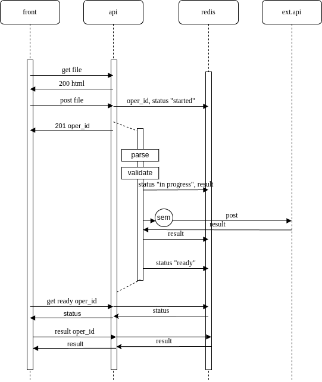

# Tetrika-test

## Описание задачи

[ссылка](https://gist.github.com/KonstantinKlepikov/9e4a882e7ec5456ee30393546505c55d)

## Схема приложения



## Ресурсы

### Разработка локально

Для запуска необходимо клонировать репозиторий и поместить в корень репозитория `.env` файл следующего содержания

```bash
# redis url
REDIS_URL=redis://tetrika-redis:6379/0
```

Вам потребуется `docker compose 3.8` и утилита `make` для запуска стека.

### Старт и остановка dev стека

1. Перейди в `cd api/app`
2. Установи poetry окружение и подготовь линтер. Для этого используй `poetry config virtualenvs.in-project true` и команду `poetry install --with dev`
3. Для vscode создай проект `code .` в корне проекта и укажи путь к нтерпретатору. Перезапусти IDE.
4. Внутри контейнера можно выполнить:

    - `pytest -v -s -x` для тестирования
    - используй `python -m IPython` для проверок кода
    - `mypy --install-types`
    - `mypy app` и `flake8 app`

- `make serve` для запуска dev-стека
- `make down` остановка и удаление стека
- пересобрать отдельный сервис можно так `docker compose up -d --no-deps --build <service-name>`

### Ссылки на локальные ресурсы, которые вы можете использовать для контроля работоспособности стека

- [api swagger docs](http://localhost:8301/docs/)
- [form](http://localhost:8301/api/v1/file)

### Общее затраченное время и выполненные задачи

- [x] project
- [x] docker stack
- [x] integrate with redis
- [x] get file endpoint
- [x] post file endpoint
- [x] stream and check file type
- [x] operative id in redis. Add empty result and status
- [x] parsing file
- [x] validate file (schema)
- [x] update result and status
- [x] aiohttp requests with sem. Updtae result
- [ ] time it (to fast 1.427114725112915)
- [ ] refactoring
- [ ] chek result endpoint
- [ ] get result endpoint
- [ ] front
- [ ] errors
- [ ] tests
- [ ] docs
