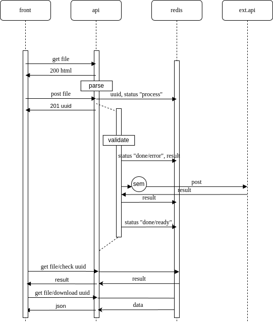

# Tetrika-test

## Описание задачи

[ссылка](https://gist.github.com/KonstantinKlepikov/9e4a882e7ec5456ee30393546505c55d)

## Схема приложения

## TODO

- [x] project
- [ ] docker stack
- [ ] integrate with redis
- [ ] get file endpoint
- [ ] post file endpoint (filestream)
- [ ] middlewire
- [ ] operative id in redis. Add empty result and status
- [ ] parsing file
- [ ] validate file (schema)
- [ ] update result and status
- [ ] aiohttp requests with sem. Updtae result
- [ ] update status
- [ ] get ready endpoint
- [ ] get result endpoint
- [ ] errors
- [ ] tests
- [ ] docs
